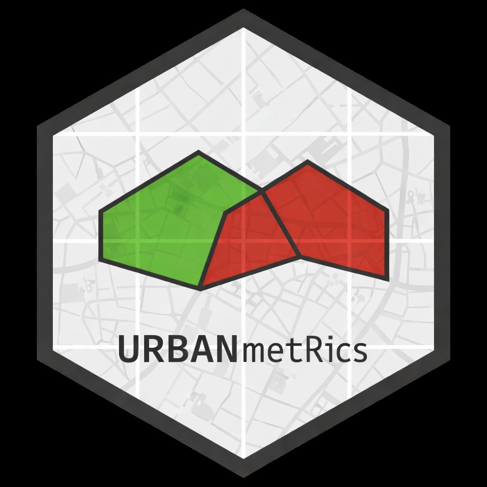

# urbanMetRics 


[GitHub Repository](https://github.com/frankalou/urbanMetRics)

URBANmetRics provides a modular workflow to extract, classify, and quantify urban structures from OpenStreetMap (OSM).
It focuses on buildings, green spaces, and transport infrastructure, and combines their metrics into an integrated Urban Index.

## Features

The package includes:
- Predefined OSM tag lists
- Structure extraction (buildings, green, transport)
- Structure classification
- Metric computation
- Urban Index calculation

## Installation

```{r}
devtools::install_github("frankalou/urbanMetRics")
```

## Workflow overview

1. **Structure extraction** 
   - building_structure()  
   - green_structure()  
   - transport_structure()

2. **Metric computation**
   - building_metrics()  
   - green_metrics()  
   - transport_metrics()

3. **Urban Index calculation**
   - urban_index()

## Example Workflow

```{r}
library(URBANmetRics)
library(sf)

# 1. Define an Area of Interest (AOI): Würzburg City Center
aoi <- st_as_sf(
  st_sfc(
    st_polygon(list(rbind(
      c(9.9260, 49.7945),  # NW
      c(9.9380, 49.7945),  # NE
      c(9.9380, 49.7870),  # SE
      c(9.9260, 49.7870),  # SW
      c(9.9260, 49.7945)   # back to start
    ))),
    crs = 4326
  )
)

# 2. Extract structures
bld <- building_structure(aoi)
greens <- green_structure(aoi)
transport <- transport_structure(aoi)

# Optional: Visualize AOI with extracted structures
aoi_3857 <- st_transform(aoi, 3857)
plot(st_geometry(aoi_3857), col = NA, border = "black", lwd = 2,
     main = "AOI - Würzburg City Center")
plot(st_geometry(bld), add = TRUE, col = rgb(0.8, 0.2, 0.2, 0.5))
plot(st_geometry(greens), add = TRUE, col = rgb(0.2, 0.8, 0.2, 0.5))
plot(st_geometry(transport), add = TRUE, col = "grey60")

# 3. Compute metrics
bld_metrics <- building_metrics(bld, aoi)
green_metrics <- green_metrics(greens, aoi)
transport_metrics <- transport_metrics(transport, aoi)

# 4. Compute the Urban Index
ui <- urban_index(
  building_metrics = bld_metrics$categories,
  green_metrics = green_metrics$categories,
  transport_metrics = transport_metrics$categories
)

ui
```

## Urban Index

The urban_index() function represents the final step in the URBANmetRics workflow.
It takes preprocessed building, green, and transport metric tables and computes a comprehensive set of normalized indices that describe the structural character of an Area of Interest (AOI).

### What the function computes

The function returns a named list containing the following components:

**BuildingIndex** 
- Weighted building intensity combining area‑based (70%) and mass‑based (30%) building metrics

**BuildingIndex_area**
- Area‑based building intensity (share of built‑up area relative to AOI)

**BuildingIndex_m2** 
- Mass‑based building intensity (floor area density in m² per km²)

**BuildingIndex_structure**
- Morphological building structure index based on building count density

**BuildingDiversityIndex**
- Shannon diversity index of building categories (0 = monofunctional, 1 = highly mixed)

**GreenIndex**
- Combined green index integrating green area intensity and green–building balance

**GreenIndex_area**
- Area‑based green intensity (share of green area relative to AOI)

**GreenIndex_balance**
- Balance between green and built structures (0 = building‑dominated, 0.5 = balanced, 1 = green‑dominated)

**TransportIndex**
- Transport supply index combining boosted transport length and transport object density

**SustainableTransportScore**
- Share of sustainable transport modes (cycling, walking, public transport, tram, rail)

**UrbanBalanced**
- Balanced urban index (equal weighting of built, green, and transport)

**UrbanLivability**
- Livability index emphasizing green infrastructure and sustainable transport

**UrbanAccessibility**
- Accessibility index emphasizing transport supply and sustainable modes

### How the indices are normalized

All indices are normalized using grounded upper bounds derived from typical values in German and European cities:
- Building area share: max 40%
- Building floor area density: max 250,000 m²/km²
- Building count density: max 3,000 buildings/km²
- Green area share: max 60%
- Transport length: max 15 km/km² (boosted)
- Transport object density: max 300 objects/km²

Values exceeding these thresholds are capped at 1.

This ensures that all indices are:
- bounded between 0 and 1
- comparable across AOIs
- interpretable without additional scaling

### Interpretation

- Values close to 1 indicate high structural intensity
  (e.g. dense buildings, abundant green, strong transport supply)
- Values around 0.5 represent moderate levels typical for mixed urban areas
- Values below 0.3 indicate low structural presence
  (e.g. sparse buildings, limited green, weak transport infrastructure)

The Urban Index therefore provides a multi‑dimensional, interpretable summary of urban form, suitable for comparative analysis and spatial research.

## Package Structure
```{r}
URBANmetRics/
├── R/
│   ├── osm_structure.R
│   ├── osm_metrics.R
│   ├── osm_building_tags.R
│   ├── osm_green_tags.R
│   ├── osm_transport_tags.R
│   ├── building_structure.R
│   ├── green_structure.R
│   ├── transport_structure.R
│   ├── building_metrics.R
│   ├── green_metrics.R
│   ├── transport_metrics.R
│   ├── urban_index.R
├── DESCRIPTION
├── NAMESPACE
├── LICENSE
└── README.Rmd
```

The package follows a standard R package structure.  
All functions are stored in the `R/` directory and grouped by theme:

- **Structure extraction** (`building_structure.R`, `green_structure.R`, `transport_structure.R`)
- **Metric computation** (`building_metrics.R`, `green_metrics.R`, `transport_metrics.R`)
- **Urban Index calculation** (`urban_index.R`)
- **Utility functions** (`utils.R`)

## Dependencies

- **sf**
- **osmdata**
- **dplyr**

## Citation

If you use URBANmetRics in your research, please cite:

Frankalou (2026). *URBANmetRics: A modular workflow for extracting and quantifying urban structures from OSM.*  
GitHub: https://github.com/frankalou/urbanMetRics

## License

MIT © Franka Hupfer 

## Acknowledgements
This package was developed in the M.Sc. [EAGLE](https://eagle-science.org/) program at the University of Würzburg as part of the course *Introduction to Programming and Statistics for Remote Sensing and GIS*

This package uses data from OpenStreetMap
© OpenStreetMap contributors

